> 最近做项目用到了51单片机驱动蜂鸣器，但是一直无法驱动，后来以为是上拉电阻问题，结果发现加了上拉电阻会一直响，即使IO口输出为低电平。

​        后来发现还需要加一个下拉电阻以保证不受干扰。

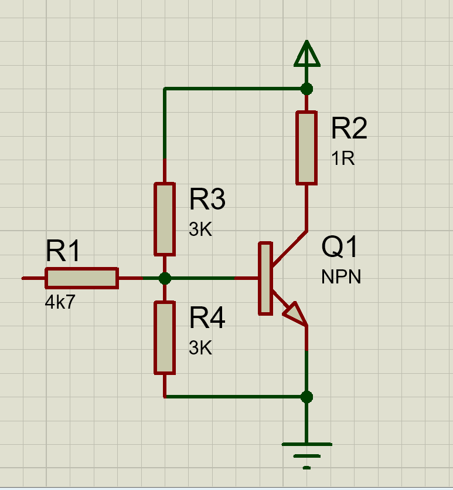

> 参考：[https://blog.csdn.net/qq_25814297/article/details/118696321?spm=1001.2014.3001.5506](https://blog.csdn.net/qq_25814297/article/details/118696321?spm=1001.2014.3001.5506)

  下面就 3.3V NPN 三极管驱动有源蜂鸣器设计，从实际产品中分析电路设计存在的问题，提出电路的改进方案，使读者能从小小的蜂鸣器电路中学会分析和改进电路的方法，从而设计出更优秀的产品，达到抛砖引玉的效果。

# 常见错误接法

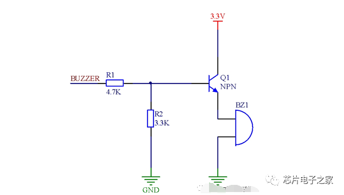

  图1 为典型的错误接法，当 BUZZER 端输入高电平时蜂鸣器不响或响声太小。当 I/O 口为高电平时，基极电压为 3.3/4.7*3.3V≈2.3V，由于三极管的压降 0.6~0.7V，则三极管射 极电压为 2.3-0.7=1.6V，驱动电压太低导致蜂鸣器无法驱动或者响声很小。

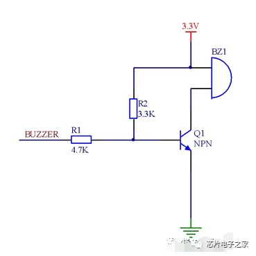

图2 错误接法2

  图2 为第二种典型的错误接法，由于上拉电阻R2，BUZZER 端在输出低电平时，由于 电阻R1和R2的分压作用，三极管不能可靠关断。

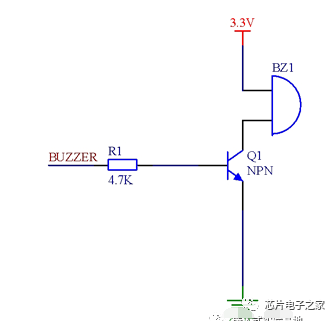

  图3 为第三种错误接法，三极管的高电平门槛电压就只有 0.7V，即在 BUZZER 端输入 压只要超过0.7V就有可能使三极管导通，显然0.7V的门槛电压对于数字电路来说太低了， 电磁干扰的环境下，很容易造成蜂鸣器鸣叫。

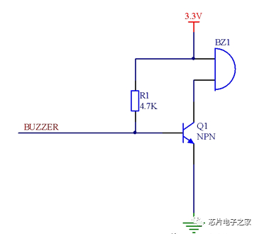

  图 4 为第四种错误接法，当CPU的GPIO管脚存在内部下拉时，由于 I/O 口存在输入阻抗，也可能导致三极管不能可靠关断，而且和图3一样BUZZER端输入电压只要超过0.7V就有可能使三极管导通。

  以上几种用法我觉得也不能说是完全不行，对于器件的各种参数要求会比较局限，不利于器件选型，抗干扰性能也比较差。

# NPN 三极管控制有源蜂鸣器常规设计

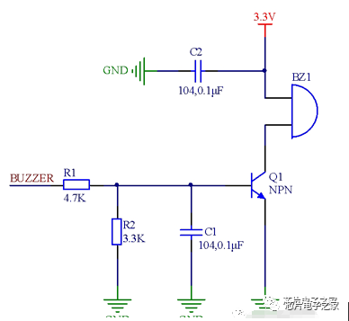

  图 5 为通用有源蜂鸣器的驱动电路。电阻R1为限流电阻，防止流过基极电流过大损坏三极管。电阻R2有着重要的作用，第一个作用：R2 相当于基极的下拉电阻。如果A端被悬空则由于R2的存在能够使三极管保持在可靠的关断状态，如果删除R2则当BUZZER输入端悬空时则易受到干扰而可能导致三极管状态发生意外翻转或进入不期望的放大状态，造成蜂鸣器意外发声。第二个作用：R2可提升高电平的门槛电压。如果删除R2，则三极管的高电平门槛电压就只有0.7V，即A端输入电压只要超过0.7V 就有可能导通，添加R2的情况就不同了，当从A端输入电压达到约2.2V 时三极管才会饱和导通，具体计算过程如下：

  假定β =120为晶体管参数的最小值，蜂鸣器导通电流是15mA。那么集电极电流IC=15mA。则三极管刚刚达到饱和导通时的基极电流是 IB=15mA/120=0.125mA。流经R2的电流是0.7V/3.3kΩ=0.212mA，流经R1的电流 IR1=0.212mA +0.125mA=0.337 mA。最后算出BUZZER端的门槛电压是0.7V+0.337mA× 4.7kΩ=2.2839V≈2.3V。

  图中的C2为电源滤波电容，滤除电源高频杂波。C1可以在有强干扰环境下，有效的滤除干扰信号，避免蜂鸣器变音和意外发声，在 RFID射频通讯、Mifare卡的应用时，这里初步选用0.1uF 的电容，具体可以根据实际情况选择。

# 改进方案

  蜂鸣器竟然有EMI 辐射？！在 NPN 3.3V 控制有源蜂鸣器时，在电路的 BUZZER 输入 高电平，让蜂鸣器鸣叫，检测蜂鸣器输入管脚（NPN 三极管的C极处信号，发现蜂鸣器在发声时，向外发生1.87KHz，-2.91V 的脉冲信号，如图 6 所示。

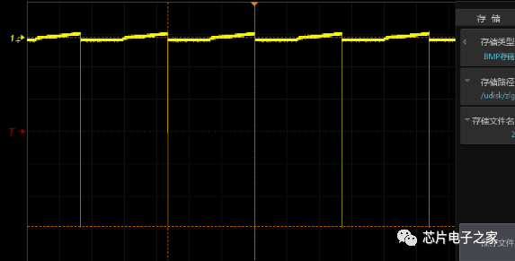

图 6 蜂鸣器自身发放脉冲

  在电路的BUZZER 输入20Hz的脉冲信号，让蜂鸣器鸣叫，检测蜂鸣器输入管脚处信号，发现蜂鸣器在发声时，在控制电平上叠加了1.87KHz，-2.92V 的脉冲信号，并且在蜂鸣器关断时出现正向尖峰脉冲（≥10V），如图7所示。

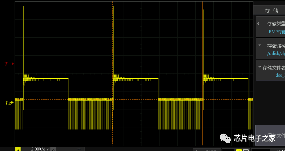

  图7中1.87KHz，-2.92V 的脉冲信号应该是有源蜂鸣器内部震荡源释放出来的信号。常用有源蜂鸣器主要分为压电式、 电磁震荡式两种， iMX283 开发板上用的是压电式蜂鸣器，压电式蜂鸣器主要由多谐振荡器、压电蜂鸣片、阻抗匹配器及共鸣箱、外壳等组成，而多谐震荡器由晶体管或集成电路构成，我们所用的蜂鸣器内部含有晶体管震荡电路（有兴趣的朋友可以自己拆开看看）。

  有源蜂鸣器产生脉冲信号能量不是很强，可以考虑增加滤波电容将脉冲信号滤除。在有源蜂鸣器的两端添加一个104的滤波电容，脉冲信号削减到-110mV，如图 8 所示，但顶部信号由于电容充电过慢，有点延时。

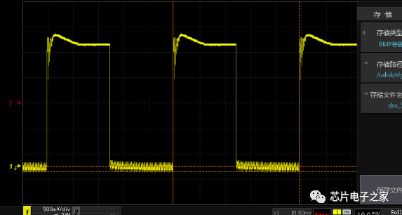

图 8 减少蜂鸣器自身发放脉冲

  消除蜂鸣器EMI辐射后改进电路图如图9所示：

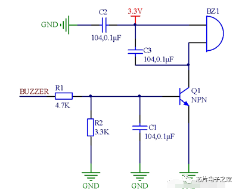

图 9 NPN 有源蜂鸣器控制电路改善后电路图

# 兼容性设计

  作为标准电路，需要考虑电路的兼容性问题，比如同样耐压不同功率的有源蜂鸣器，有 源蜂鸣器和无源蜂鸣器的兼容性问题。

## 1兼容同样耐压不同功率的有源蜂鸣器电路设计

  为了电路的兼容性和可扩展性，电路需要考虑兼容不同厂家和不同功率的蜂鸣器。同一 个耐压的蜂鸣器主要是蜂鸣器的内阻和工作电流不一样，一般 3V~5V 耐压的蜂鸣器，不同功率的蜂鸣器导通电流是 10mA~80mA。我们按照最大功率的蜂鸣器去设计电路即可，即三极管的推动电流按照 80 mA 设计。

  假定：β＝120 为晶体管参数的最小值，蜂鸣器导通电流是 80 mA。那么集电极电流 IC ＝80 mA。则三极管刚刚达到饱和导通时的基极电流 IB＝80mA／ 120＝0.667mA。流经 R2的电流是 0.7V／ 3.3kΩ＝ 0.212mA，所以流经 R1 的电流应该是 IR1=0.667mA +0.125mA=0.792mA。BUZZER 端的门槛电压是设定在 2.2V，那么 R1=(2.2V-0.7V)/ 0.792mA=1.89K。电阻取常规 2K 即可。

  如果电路更换功率稍大一点的有源蜂鸣器，可以按照上面的计算方法计算 R1 的大小。

## 2兼容有源蜂鸣器和无源蜂鸣器电路设计

  在电路的设计过程中，往往会碰到需求变更，比如项目前期，对蜂鸣器的发声频率没有 要求，但后期有要求，需要更换为无源蜂鸣器，这时就需要修改电路图，甚至修改 PCB， 这样就增加了改动成本、周期和风险。

  有源蜂鸣器和无源蜂鸣器的驱动电路区别主要在于无源蜂鸣器本质上是一个感性元件， 其电流不能瞬变，因此必须有一个续流二极管提供续流。否则，在蜂鸣器两端会有反向感应 电动势，产生几十伏的尖峰电压，可能损坏驱动三极管，并干扰整个电路系统的其它部分。而如果电路中工作电压较大，要使用耐压值较大的二极管，而如果电路工作频率高，则要选 用高速的二极管。这里选择的是 IN4148 的开关二极管。电路如图 10 所示。

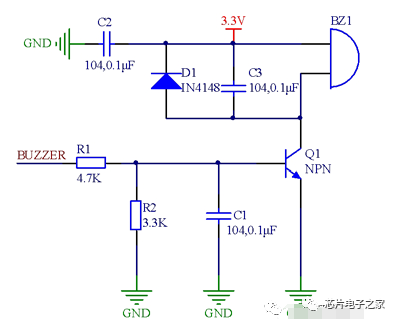
